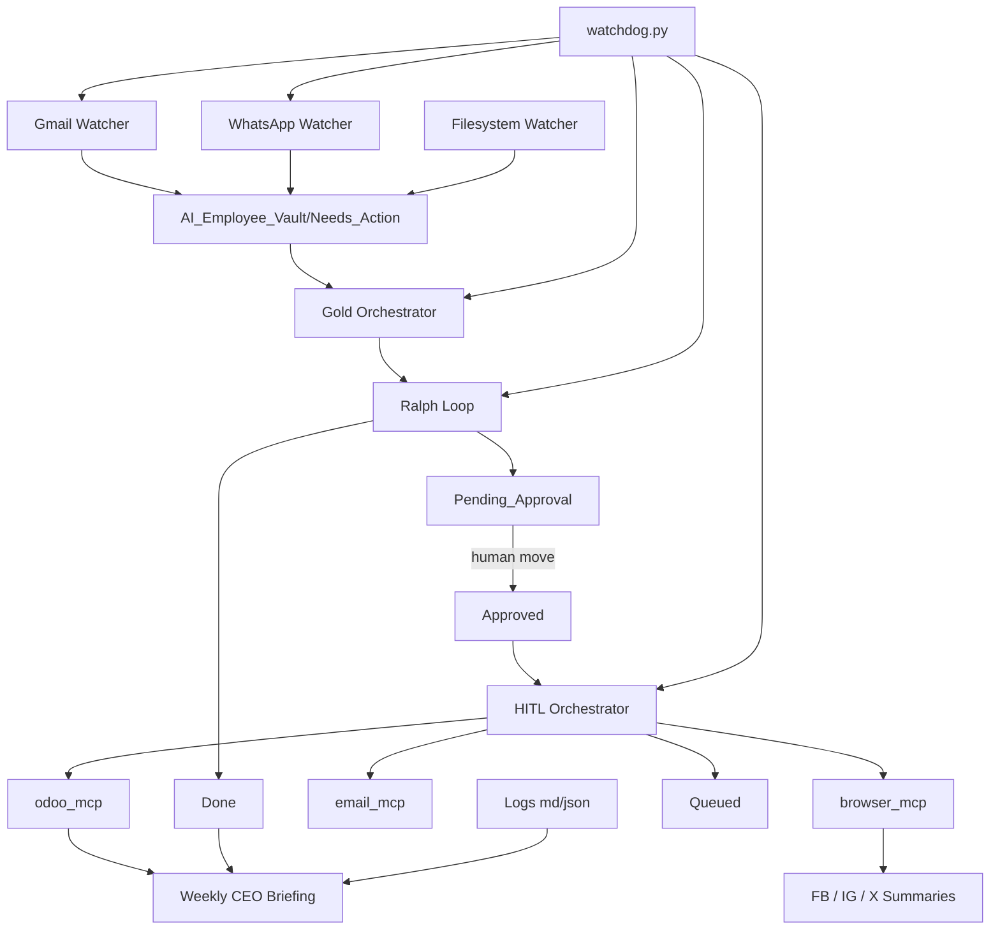

# Gold Tier Autonomous Employee

Gold Tier extends the Silver runtime into a cross-domain autonomous employee that can ingest personal work from Gmail/WhatsApp, route business work into Odoo and social channels, stop at approval boundaries, recover from transient failures, and produce weekly CEO briefings.

## Scope

- Personal domain:
  - Gmail watcher
  - WhatsApp watcher
  - `Needs_Action` intake and Ralph-loop processing
- Business domain:
  - Odoo 19 via `odoo_mcp`
  - email via `email_mcp`
  - Facebook / Instagram / X post workflows
  - weekly CEO audit briefing
- Control plane:
  - `orchestrator.py`
  - `watchers/hitl_orchestrator.py`
  - `ralph_loop.py`
  - `watchdog.py`

## Architecture



## Runtime Flow

1. Personal requests arrive through Gmail or WhatsApp watchers and become markdown tasks in `AI_Employee_Vault/Needs_Action/`.
2. `orchestrator.py` bootstraps planning context and runs the Ralph loop first for multi-step autonomy.
3. Ralph loop identifies the next best action, creates approvals for sensitive external work, and moves completed source tasks into `Done/`.
4. The owner approves by moving `APPROVAL_*.md` files into `AI_Employee_Vault/Approved/`.
5. `watchers/hitl_orchestrator.py` executes MCP tools with retry handling and JSON audit logging.
6. If Odoo is transiently unavailable, approvals move into `AI_Employee_Vault/Queued/` for later replay.
7. Weekly social drafts and the CEO briefing are generated by the Gold orchestrator on schedule or by force flags.

## Key Files

- [orchestrator.py](/Users/mac/Desktop/P/Silver Tier/Ai-Employee-Hackathon/Gold Tier/orchestrator.py)
- [ralph_loop.py](/Users/mac/Desktop/P/Silver Tier/Ai-Employee-Hackathon/Gold Tier/ralph_loop.py)
- [watchers/hitl_orchestrator.py](/Users/mac/Desktop/P/Silver Tier/Ai-Employee-Hackathon/Gold Tier/watchers/hitl_orchestrator.py)
- [watchdog.py](/Users/mac/Desktop/P/Silver Tier/Ai-Employee-Hackathon/Gold Tier/watchdog.py)
- [mcp_servers/odoo_mcp.py](/Users/mac/Desktop/P/Silver Tier/Ai-Employee-Hackathon/Gold Tier/mcp_servers/odoo_mcp.py)
- [mcp_servers/browser_mcp.py](/Users/mac/Desktop/P/Silver Tier/Ai-Employee-Hackathon/Gold Tier/mcp_servers/browser_mcp.py)
- [weekly_ceo_briefing.sh](/Users/mac/Desktop/P/Silver Tier/Ai-Employee-Hackathon/Gold Tier/weekly_ceo_briefing.sh)
- [test_gold.py](/Users/mac/Desktop/P/Silver Tier/Ai-Employee-Hackathon/Gold Tier/test_gold.py)

## Commands

Start the supervised Gold runtime:

```bash
cd "/Users/mac/Desktop/P/Silver Tier/Ai-Employee-Hackathon/Gold Tier"
uv run python watchdog.py --project-root .
```

Run one orchestrator pass:

```bash
cd "/Users/mac/Desktop/P/Silver Tier/Ai-Employee-Hackathon/Gold Tier"
uv run python orchestrator.py --project-root . --once
```

Force weekly audit and X generation:

```bash
cd "/Users/mac/Desktop/P/Silver Tier/Ai-Employee-Hackathon/Gold Tier"
uv run python orchestrator.py --project-root . --once --force-weekly-audit --force-twitter
```

Replay queued Odoo approvals after recovery:

```bash
cd "/Users/mac/Desktop/P/Silver Tier/Ai-Employee-Hackathon/Gold Tier"
mv AI_Employee_Vault/Queued/APPROVAL_*.md AI_Employee_Vault/Approved/ 2>/dev/null || true
UV_CACHE_DIR=/tmp/uv-cache uv run python watchers/hitl_orchestrator.py --vault AI_Employee_Vault --process-once
```

Run the Gold test harness:

```bash
cd "/Users/mac/Desktop/P/Silver Tier/Ai-Employee-Hackathon/Gold Tier"
python3 test_gold.py
```

Run the full unit test suite:

```bash
cd "/Users/mac/Desktop/P/Silver Tier/Ai-Employee-Hackathon/Gold Tier"
python3 -m unittest discover -s tests
```

## Lessons Learned

- File-based approvals are simpler to audit than in-memory task state.
- Ralph loop autonomy works best when it stops at explicit human approval boundaries.
- MCP execution needs structured JSON logs, not just markdown notes, for submission-grade traceability.
- Odoo downtime should degrade into a queue, not a rejection, because accounting actions are often retriable.
- MCP subprocesses must receive the same `.env` configuration as direct shell runs, otherwise approved actions become flaky.
- A process watchdog is necessary once the system spans Gmail, WhatsApp, Odoo, social, HITL, and weekly reporting.
- Deterministic integration tests are easier to trust when external calls are stubbed but vault side effects remain real.

## Submission Checklist

- [ ] `ODOO_URL`, `ODOO_DB`, and `ODOO_API_KEY` are set in `.env`
- [ ] social credentials are configured if real FB / IG / X publish is required
- [ ] `uv run playwright install chromium` has been run
- [ ] `uv run python watchdog.py --project-root .` starts cleanly
- [ ] `python3 -m unittest discover -s tests` passes
- [ ] `python3 test_gold.py` passes
- [ ] `AI_Employee_Vault/Logs/<today>.json` shows MCP audit entries
- [ ] `AI_Employee_Vault/Dashboard.md` is refreshed
- [ ] `AI_Employee_Vault/Briefings/` contains a CEO briefing sample
- [ ] pending approvals are visible and human-reviewable
